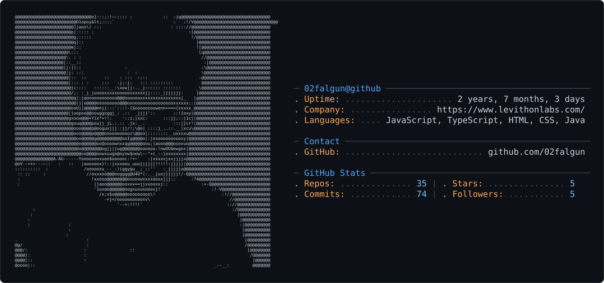

<picture>
  <source media="(prefers-color-scheme: dark)" srcset="dark_mode.svg" />
  <source media="(prefers-color-scheme: light)" srcset="light_mode.svg" />
  
</picture>

<h1 align="center">Hi 👋, I'm Kavya Kumar Thakur</h1>

 Aspiring Software & AI Engineer

  Building real-world software and exploring the possibilities of AI

### Tech Stack

  

### Connect

  <a href="https://linkedin.com/in/kavya-kumar-thakur">LinkedIn</a> ·
  <a href="https://leetcode.com/kavya_kumar_thakur">LeetCode</a> ·
  <a href="https://www.codechef.com/users/kavyathakur449">CodeChef</a>

